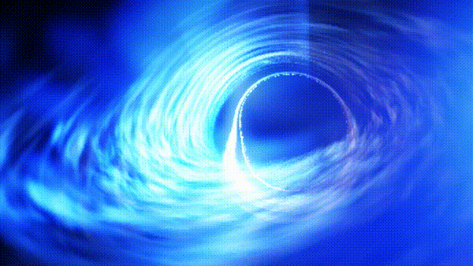
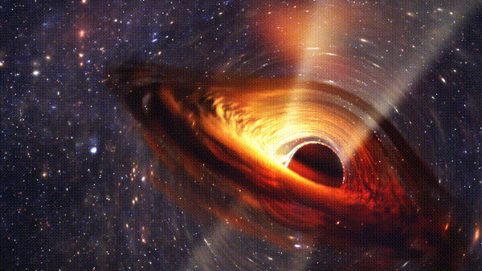
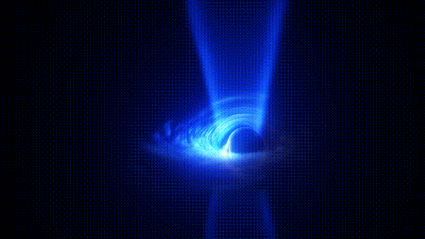
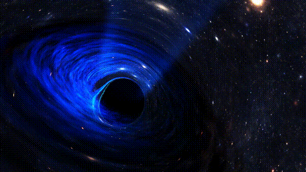
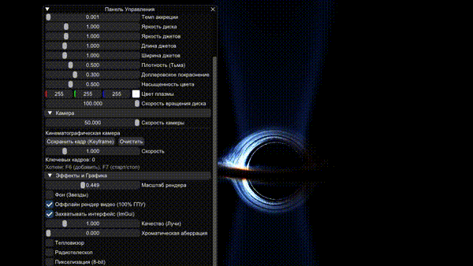

# Реалтайм-рендер Черной Дыры 2.0 (Black Hole Renderer)



---

Высокореалистичный движок рендеринга черной дыры в реальном времени, написанный на C++ и GLSL. Проект использует Raymarching и метрику Керра-Шилда для симуляции гравитационного линзирования вращающейся черной дыры, а также аккреционного диска и релятивистских джетов.

## Ключевые возможности и эффекты

### Аккреционный диск и Релятивистский эффект Доплера
Диск раскаленной плазмы, вращающийся вокруг горизонта событий. Свет с той стороны диска, которая движется к наблюдателю, доплеровски усиливается (становится ярче и синее), а с противоположной — тускнеет и краснеет. Полностью настраиваемая плотность и яркость.



### Релятивистские джеты (Струи плазмы)
Программа симулирует выбросы колоссальной энергии с полюсов вращающейся черной дыры. Джеты формируются магнитными полями и выстреливают плазмой на околосветовых скоростях. Вы можете настроить длину, ширину и яркость джетов прямо во время симуляции.



### Гравитационное линзирование и метрика Керра
Свет искривляется под воздействием массы черной дыры. Вращение (параметр спина Керра) можно изменять от 0 (Шварцшильдовская дыра) до 0.999 (экстремальная дыра), что динамически деформирует горизонт событий и закручивает пространство вокруг полюсов.



---

## Управление и Горячие клавиши

Программа имеет встроенный UI (ImGui) для настройки всех параметров физики в реальном времени.

| Клавиша / Мышь | Действие |
| :--- | :--- |
| **Space (Пробел)** | Скрыть / Показать интерфейс (UI) |
| **W, A, S, D** | Перемещение камеры |
| **Мышь** | Вращение камеры |
| **Колесико мыши** | Изменение скорости полета |
| **F5** | Начать / Остановить запись видео |
| **F6** | Добавить ключевой кадр (кинематографичная камера) |
| **F7** | Запустить пролет по ключевым кадрам |
| **F12** | Сделать скриншот |

---

## Настройки симуляции и ImGui

Интерфейс программы (построенный на **ImGui**) позволяет в реальном времени изменять параметры черной дыры Керра-Ньюмана:
- **Масса ЧД (размер)**: Задает горизонт событий и масштаб гравитационной линзы.
- **Спин (Вращение a)**: Определяет параметр вращения Керра от 0 (шварцшильдовская черная дыра) до 0.999 (экстремальная черная дыра).
- **Заряд (Q)**: Превращает черную дыру в метрику Керра-Ньюмана. Экстремальные значения отталкивают горизонт.
- **Темп аккреции и Плотность**: Влияют на толщину, светимость аккреционного диска и поглощение света.

**Особенности работы с интерфейсом (ImGui) при записи:**
- По умолчанию видео записывается абсолютно чистым (только черная дыра), даже если на экране открыто меню.
- В меню "Эффекты и Графика" есть специальная галочка **"Захватывать интерфейс (ImGui)"**. Если её включить, на записанном видео будет видна панель управления — идеально для демонстрации работы движка.



---

## Инструкция по сборке

### Сборка под Windows
Проект готов для сборки через MSVC (Visual Studio 2019/2022), MinGW или CLion. Библиотеки (GLFW, ImGui) уже включены в репозиторий, дополнительных установок не требуется.

```bash
git clone <your_repo_url>
cd megarealstic_clion
mkdir cmake-build-release && cd cmake-build-release
cmake .. -DCMAKE_BUILD_TYPE=Release
cmake --build . --config Release
```

Запустите скомпилированный `megarealstic.exe`.

### Сборка под Linux (Ubuntu / Debian)
Для сборки под Linux вам потребуются стандартные инструменты сборки CMake и C++17.

```bash
sudo apt update
sudo apt install build-essential cmake
mkdir cmake-build-release && cd cmake-build-release
cmake .. -DCMAKE_BUILD_TYPE=Release
make -j$(nproc)
```

## Лицензия
Проект имеет открытый исходный код. Почувствуйте себя настоящим астрофизиком!
